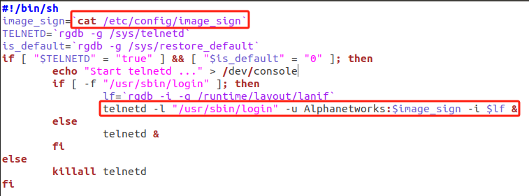
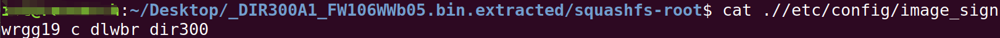
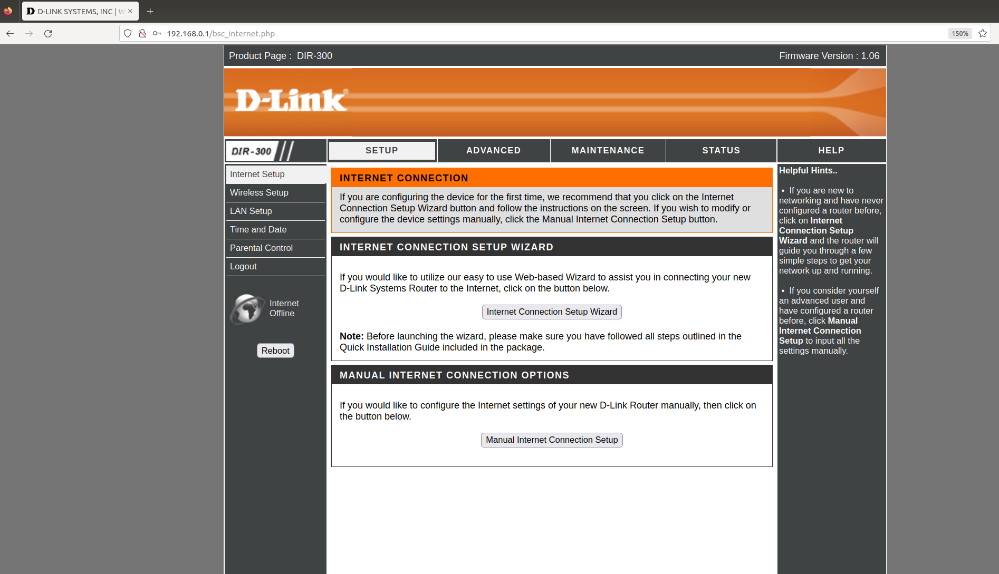
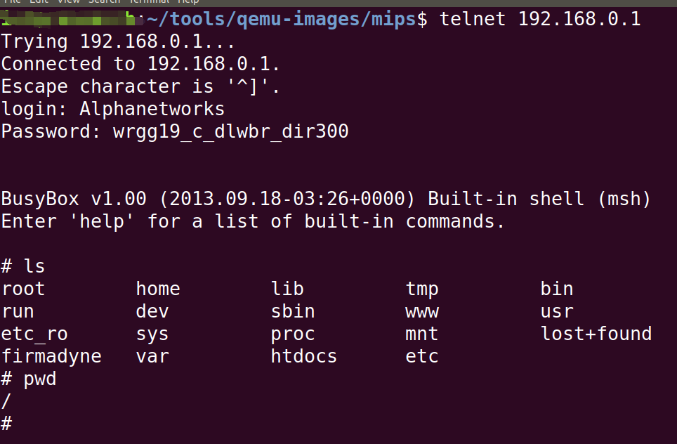

# Firmware:
version：DIR-300_REVA_FIRMWARE_v1.06B05_WW 
download link: https://www.dlinktw.com.tw/techsupport/ProductInfo.aspx?m=DIR-300
# Description:
After the system is initialized, the telnet service is started and the username and password are hardcoded
# Analyse：

Telnet hardcoded:Alphanetworks and wrgg19_c_dlwbr_dir300
